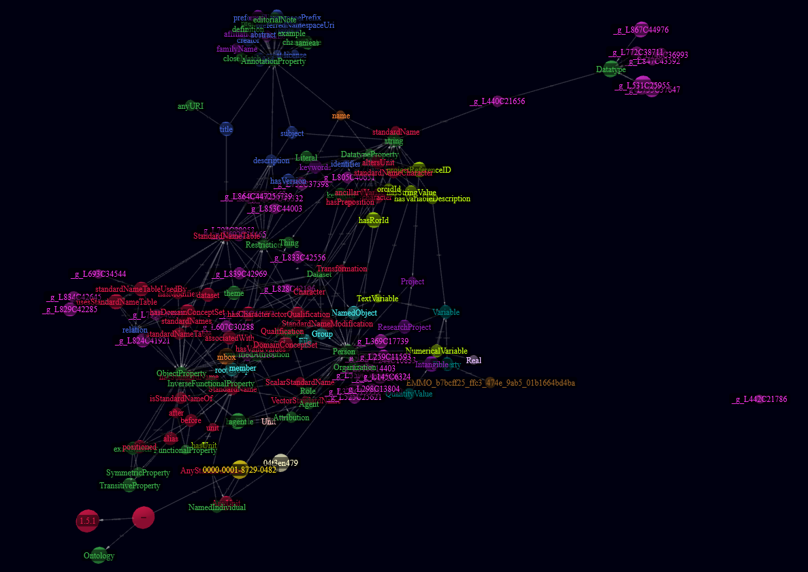

# sSNO - simple Standard Name Ontology

This repository contains the (draft) sSNO ontology. The ontology allows the usage of so-called "standard names", which
are originally introduced by the [CF Conventions](http://cfconventions.org/). The basic concept, however, is applicable
to other research topics, too. The ontology is called "simple", because, at this stage, it only covers the basic
concept. Very briefly it goes like this:

- A *standard name table* is a document, which stores all standard names of a certain topic.
- A *standard name* is a name associated with a canonical unit, which is used to describe a certain quantity and
  underlies certain construction rules.
- The construction rules are defined in "guidelines" associated with the standard name table.

The ontology is stored in the turtle file [ssno.ttl](ssno.ttl), the context JSON-LD file
is [ssno_context.jsonld](https://raw.githubusercontent.com/matthiasprobst/ssno/main/ssno_context.jsonld).
A [Guide](GUIDE.md) helps with the first steps, a [jupyter notebook](./examples/Tutorial.ipynb) is provided, too.

## Documentation

The documentation of the ontology is available [online](https://matthiasprobst.github.io/ssno/) and a tutorial guide is
available [here](GUIDE.md).

If you want to integrate the ontology into your Python scripts, please find a corresponding library with
the [SSNOlib](https://github.com/matthiasprobst/SSNOlib/).

## Contribution

Contributions are happily taken via issues in the repository.

## Developer instructions:

1. Updating the ontology:

- Update the `.ttl` file [ssno.ttl](ssno.ttl)
- You may use Protégé or any other ontology editor to do so.

2. Generate the context file:

- Run `deploy.py` (run `pip install -r requirements.txt` to install the required packages)
- It will build the ontology web page (using [widoco](https://dgarijo.github.io/Widoco/doc/tutorial/))
- It will also generate the context file [ssno_context.jsonld](ssno_context.jsonld)
